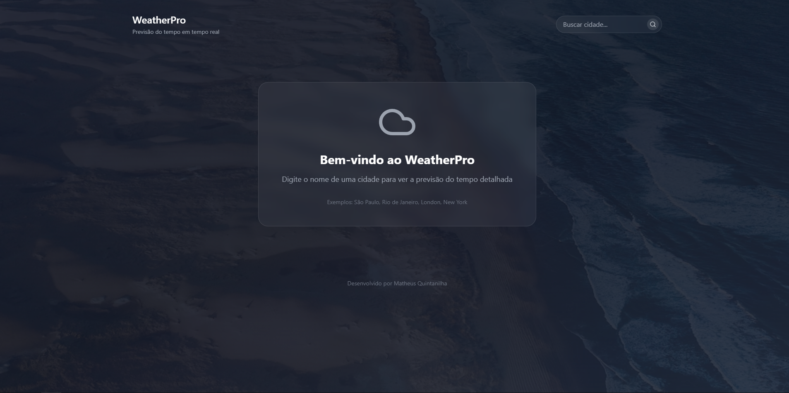
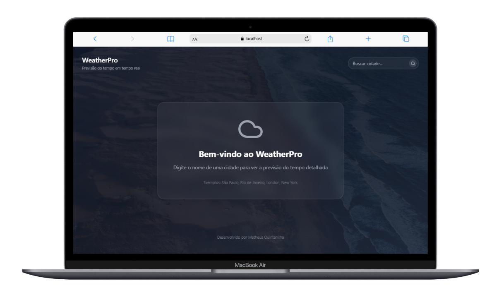

# 🌤️ WeatherPro



> **Uma aplicação moderna de previsão do tempo construída com React, Vite e Tailwind CSS**

[](https://reactjs.org/)
[](https://vitejs.dev/)
[](https://tailwindcss.com/)
[](https://openweathermap.org/)

## 🚀 Demonstração

🌐 [Demo Online](https://your-demo-link.vercel.app)

### 📱 Screenshots

| Desktop                                    | Mobile                                     |
| ------------------------------------------- | ------------------------------------------ |
|  |  |

## 🛠️ Instalação e Configuração

### Pré-requisitos
- Node.js 18+
- npm ou yarn
- API Key do OpenWeatherMap (gratuita)

### 1️⃣ Clone o Repositório

```bash
git clone https://github.com/MatheusQuintanilhaa/WeatherPro.git
cd WeatherPro
```

### 2️⃣ Instale as Dependências

```bash
npm install
# ou
yarn install
```

### 3️⃣ Configure as Variáveis de Ambiente

```bash
# Obtenha sua API key gratuita em: https://openweathermap.org/api
# Substitua no arquivo src/App.jsx:
const API_KEY = 'SUA_API_KEY_AQUI';
```

### 4️⃣ Execute o Projeto

```bash
npm run dev
# Acesse: http://localhost:5173
```

## 👨‍💻 Autor

**Matheus Quintanilha**

- 🌐 [Portfólio](https://portflio-matheus-quintanilha.vercel.app/)
- 💼 [LinkedIn](https://www.linkedin.com/in/matheus-quintanilhadev/)
- 🐱 [GitHub](https://github.com/MatheusQuintanilhaa)
- 📧 matheussantos.quintanilha@gmail.com

---

<div align="center">
⭐ Se este projeto te ajudou, deixe uma estrela!  
</div>